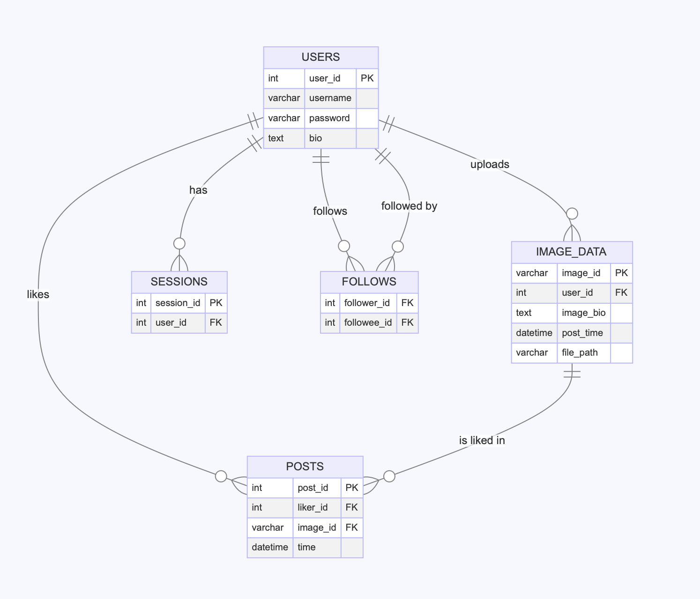

# Quackstagram - A Social Media Platform with SQL Backend

## Course Project
**Deadline:** Sunday, May 26, 2024

## Students

| Student name     | Student ID | Contributions |
|------------------|------------| ------------- |
| H.PHAM           | i6358696   |               |
| KAROL PLANDOWSKI | i6365846   |               |

  
---  

## Table of Contents
1. [Project Overview](#project-overview)
2. [Part A – Design a Relational Database Schema](#part-a)
3. [Part B – Implement a MySQL-Compatible Relational Database Schema](#part-b)
4. [Part C – Integration and Functional Application Development](#part-c)
5. [Part D – Profit Maximization SQL Queries](#part-d)
6. [Part E – Report](#part-e)
7. [Submission Guidelines](#submission-guidelines)
8. [Marking Scheme](#marking-scheme)

---  

## Project Overview
This version of the project aims to enhance the capabilities of Quackstagram by integrating a MySQL-compatible relational database schema. The Database Schema will be designed based on the features and functionalities of Quackstagram, and the application will be modified to interact with the database instead of text files. The project will also include the implementation of SQL queries to answer specific questions for Cheapo Technologies.

## Part A – Design a Relational Database Schema

### Objective
Design a relational database schema based on Quackstagram’s features and functionalities inferred from the Java source code.

### Tasks
## 1. Detailed Entity Analysis

- **Identify Entities:** users, posts, image_data, follows, sessions

- **Identify Attributes:**
   - **users:** user_id, username, password, bio
   - **posts:** post_id, liker_id, image_id, timestamp
   - **image_data:** image_id, user_id, image_bio, post_time, file_path
   - **follows:** follower_id, followee_id
   - **sessions:** session_id, user_id

## 2. Relationship Mapping

- **Determine Relationship Types**

   1. **Users to Image Data: One-to-Many**
      - One user can have many images.
      - Relationship: `user_id` in `image_data` references `user_id` in `users`.

   2. **Users to Posts: One-to-Many**
      - One user can have multiple activities (likes).
      - Relationship: `liker_id` in `posts` references `user_id` in `users`.

   3. **User to User (Follows): Many-to-Many**
      - One user can follow multiple users and be followed by multiple users.
      - Relationship: `follower_id` and `followee_id` in `follows` both reference `user_id` in `users`.

   4. **User and Session: One-to-Many**
      - One user can have many logged-in sessions.
      - Relationship: `user_id` in `sessions` references `user_id` in `users`.

   5. **Post and Image Data: One-to-Many**
      - One post can be liked multiple times.
      - Relationship: `image_id` in `posts` references `image_id` in `image_data`.

## 3. Normalization and Functional Dependencies

### 3.1 Functional Dependencies

#### 3.1.1 Functional Dependencies for `users` Table
- user_id -> username, password, bio
- username -> user_id, password, bio

#### 3.1.2 Functional Dependencies for `posts` Table
- post_id -> liker_id, image_id, timestamp
- liker_id, image_id -> post_id, timestamp

#### 3.1.3 Functional Dependencies for `image_data` Table
- image_id -> user_id, image_bio, post_time, file_path

#### 3.1.4 Functional Dependencies for `follows` Table
- follower_id, followee_id -> Unique key

#### 3.1.5 Functional Dependencies for `sessions` Table
- session_id -> user_id

### 3.2 Normalize Tables up to 3NF or BCNF

#### 3.2.1 `users` Table: 3NF
- **Attributes:** user_id, username, password, bio
- **Primary Key:** user_id

**Proof of 3NF:**
- Each attribute contains only atomic values -> 1NF
- All non-prime attributes (username, password, bio) are fully functionally dependent on the primary key (user_id) -> 2NF
- No transitive dependencies because there are no non-prime attributes dependent on other non-prime attributes -> 3NF

#### 3.2.2 `posts` Table: 3NF
- **Attributes:** post_id, liker_id, image_id, timestamp
- **Primary Key:** post_id
- **Candidate Key:** post_id, liker_id, image_id
- **Prime Attributes:** post_id, liker_id, image_id
- **Non-Prime Attribute:** timestamp

**Proof of 3NF:**
- Each attribute contains only atomic values -> 1NF
- No partial dependencies (`timestamp` is not partially dependent on liker_id or image_id) -> 2NF
- No transitive dependencies because there are no non-prime attributes dependent on other non-prime attributes -> 3NF

#### 3.2.3 `image_data` Table: 3NF
- **Attributes:** image_id, user_id, image_bio, post_time, file_path
- **Primary Key:** image_id
- **Candidate Key:** image_id
- **Prime Attribute:** image_id
- **Non-Prime Attributes:** user_id, image_bio, post_time, file_path

**Proof of 3NF:**
- Each attribute contains only atomic values -> 1NF
- All non-prime attributes (user_id, image_bio, post_time, file_path) are fully functionally dependent on the primary key (image_id) -> 2NF
- No non-prime attributes dependent on other non-prime attributes -> 3NF

#### 3.2.4 `follows` Table: 3NF
- **Attributes:** follower_id, followee_id
- **Primary Key:** follower_id, followee_id
- **Candidate Key:** follower_id, followee_id
- **Prime Attributes:** follower_id, followee_id
- **Non-Prime Attributes:** None

**Proof of 3NF:**
- Each attribute contains only atomic values -> 1NF
- All non-prime attributes are fully functionally dependent on the primary key (follower_id, followee_id) -> 2NF
- No non-prime attributes dependent on other non-prime attributes -> 3NF

#### 3.2.5 `sessions` Table: 3NF
- **Attributes:** session_id, user_id
- **Primary Key:** session_id
- **Candidate Key:** session_id
- **Prime Attribute:** session_id
- **Non-Prime Attribute:** user_id

**Proof of 3NF:**
- Each attribute contains only atomic values -> 1NF
- All non-prime attributes (user_id) are fully functionally dependent on the primary key (session_id) -> 2NF
- No non-prime attributes dependent on other non-prime attributes -> 3NF
   
## 4. ERD  
   
   

## Table Example

- **Users**

| ID       | Name    | Code           | Description                       |
|----------|---------|----------------|-----------------------------------|
| 1        | Lorin   | Š4ÇŠ4Ç         | Fierce warrior, not solo          |
| 2        | Xylo    | ʛMư˽{ƤʩOƗ      | Humanoid robot much like the rest |
| 3        | Zara    | ʛMư˽{ƤʩOƗ      | Xylo and I are not the same!      |
| 4        | Mystar  | Š4ÇŠ4Ç         | Bio                               |
| 5        | quack1  | Š4ÇŠ4ÇŠ4Ç      | This is my Bio                    |
| 6        | quacksta| Š4ÇŠ4ÇŠ4Ç      | Bio                               |
| 7        | quack2  | Š4ÇŠ4ÇŠ4Ç      | Bio                               |
| 8        | quack3  | Š4ÇŠ4ÇŠ4Ç      | Bio                               |
| 9        | quack6  | ŧ5Ëŧ5Ëŧ5Ë      | Bio                               |
| 10       | quack7  | Š4ÇŠ4ÇŠ4Ç      | Bio                               |
| 11       | User111 | Š4ÇŠ4ÇŠ4Ç      | Bio1     

Note: Users from id 108 onward have been created by an LLM, so their corresponding passwords were not encrypted.

- **Image Data**

| Image ID         | User ID | Caption             | Timestamp           | File Path                                      |
|------------------|---------|---------------------|---------------------|-----------------------------------------------|
| kidprobambo123_1 | 18      | Enter a caption     | 2024-03-03 15:42:35 | src/main/java/img/uploaded/kidprobambo123_1.jpg |
| kidprobambo123_2 | 18      | Enter a caption     | 2024-03-03 15:42:42 | src/main/java/img/uploaded/kidprobambo123_2.JPG |

- **Posts (Like Activity Log)**

| Post ID | User ID | Image ID | Timestamp           |
|---------|---------|----------|---------------------|
| 62      | 1       | Mystar_1 | 2024-05-11 20:01:19 |
| 63      | 1       | Mystar_2 | 2024-05-11 20:02:10 |
| 64      | 1       | Zara_1   | 2024-05-12 15:23:51 |
| 65      | 1       | Xylo_1   | 2024-05-12 17:00:17 |
| 66      | 1       | Xylo_2   | 2024-05-12 17:00:18 |

- **Sessions**

| session_id | user_id |
|------------|---------|
| 1          | 3       |
| 2          | 20      |
| 3          | 20      |
| 4          | 20      |
| 5          | 3       |
| 6          | 20      |
| 7          | 20      |

- **Comments** (This table is not working in the existing application)

| comment_id | commenter_id | comment_text              | comment_time          | image_id |
|------------|--------------|---------------------------|-----------------------|----------|
| 1          | 1            | Great post!               | 2024-05-01 10:00:00   | Mystar_1 |
| 2          | 2            | Interesting perspective.  | 2024-05-01 10:05:00   | Lorin_1  |
| 3          | 3            | Thanks for sharing!       | 2024-05-01 10:10:00   | Lorin_1  |
| 4          | 4            | I enjoyed this!           | 2024-05-01 10:15:00   | Lorin_1  |
| 5          | 5            | Well written!             | 2024-05-01 10:20:00   | Lorin_1  |
| 6          | 6            | I agree with you.         | 2024-05-01 10:25:00   | Lorin_1  |
| 7          | 3            | Nice post!                | 2024-05-01 10:30:00   | Lorin_1  |
| 8          | 4            | This is very informative. | 2024-05-01 10:35:00   | Lorin_1  |


---

## Part B – Implement a MySQL-Compatible Relational Database Schema
## Objective
Develop a MySQL database schema based on the design, and prepare it for integration with the Java application.

## 1. Schema.sql
   The content of this will be included in the schema.sql file.

## 2. View.sql
   1. Create 3 Views for User Behavior, Content Popularity, and System Analytics
      1.1 View to display the most active user in a period of time (user who likes more than 5 posts).
         <br/> Rationale: This view will help track user activity and engagement on the platform.
      ```sql
      CREATE VIEW ActiveUsers AS
      SELECT liker_id, COUNT(*) AS post_count
      FROM posts
      WHERE time >= '2024-05-01' AND time <= '2024-05-31'
      GROUP BY liker_id
      HAVING COUNT(*) > 5;
      ```
      1.2 View to 5 most liked photos in 2024
         <br/> Rationale: This will provide quick access to the most popular posts of this year
      ```sql
      CREATE VIEW five_most_liked_2024 AS
      SELECT image_id, COUNT(liker_id) as count
      FROM posts
      WHERE YEAR(time) = 2024
      GROUP BY image_id
      HAVING Count(post_id) > 2
      ORDER BY count DESC
      LIMIT 5;
      ```

      1.3 View to number of photos with at least 2 likes for each year
         <br/> Rationale: This will provide information on how active the platform is every year for system analytics
      ```sql
      CREATE VIEW posts_with_2_likes_per_year AS
      SELECT YEAR(time) as year, Count(image_id) as post_count
      FROM posts
      WHERE image_id IN
      (SELECT image_id
      FROM posts
      GROUP BY image_id
      HAVING COUNT(liker_id) > 2)
      GROUP BY year;
      ```

   2. Create Indexes for Performance Optimization
      2.1. Index on `user_id` in `posts` table   
         <br/> Rationale: The fetching process is used frequently in the application. Besides, this fetching requires a join operation with the `users` table, then it is beneficial to have an index on the `user_id` column in the `posts` table.  
         <br/> Performance before indexing: 0.005 seconds  
         <br/> Performance after indexing: 0.003 seconds, 60% faster.
         
      2.2. Index on `username` in `users` table   
         <br/> Rationale: The fetching of the username is used very frequently in the application for numerous functionalities, while account creation is not as often meaning this index will not cause a big trade-off.
         <br/>   
         <br/> 
    - Create 3 Views for User Behavior, Content Popularity, and System Analytics
        1. View to display the most active user in a period of time (user who likes more than 5 posts).
           ```sql
           CREATE VIEW ActiveUsers AS
           SELECT liker_id, COUNT(*) AS post_count
           FROM posts
           WHERE time >= '2024-05-01' AND time <= '2024-05-31'
           GROUP BY liker_id
           HAVING COUNT(*) > 5;
           ```
        2. View to 5 most liked photos since 2024.
           ```sql
           CREATE VIEW five_most_liked_2024 AS
           SELECT image_id, COUNT(liker_id) as count
           FROM posts
           GROUP BY image_id
           HAVING YEAR(MIN(time)) = 2024
           ORDER BY count DESC
           LIMIT 5;
           ```
        3. View to number of photos with at least 2 likes for each year.
           ```sql
           CREATE VIEW posts_with_2_likes_per_year AS
           SELECT YEAR(time) as year, Count(image_id) as post_count
           FROM posts
           WHERE image_id IN
              (SELECT image_id
              FROM posts
              GROUP BY image_id
              HAVING COUNT(liker_id) > 2)
           GROUP BY year;
           ```

## 3. Trigger

- **Triggers to prevent users from liking their posts.** This helps maintain the integrity and consistency of the database.
  ```sql
  DELIMITER //

  CREATE TRIGGER prevent_self_like
  BEFORE INSERT
  ON QuackstagramDB.posts
  FOR EACH ROW
  BEGIN
  DECLARE owner_id INT;

      SELECT user_id INTO owner_id
      FROM QuackstagramDB.image_data id 
      WHERE NEW.image_id = id.image_id;

      IF NEW.user_id = owner_id THEN
          SIGNAL SQLSTATE '45000'
          SET MESSAGE_TEXT = 'A user cannot like their own post';
      END IF;
  END;
  //

  DELIMITER ;
   ```
  
- Stored Procedure to generate report of number of likes and number of posts for each user in a specific month and year.
   ```sql
   DELIMITER //
 
   CREATE PROCEDURE QuackstagramDB.generateUserReport (
   IN userID INT,
   IN reportMonth INT,
   IN reportYear INT
   )
   BEGIN
   DECLARE post_count INT DEFAULT 0;
   DECLARE like_count INT DEFAULT 0;
   DECLARE start_date DATE;
   DECLARE end_date DATE;
 
       -- Calculate the start and end dates
       SET start_date = STR_TO_DATE(CONCAT(reportYear, '-', reportMonth, '-01'), '%Y-%m-%d');
       SET end_date = LAST_DAY(start_date);
 
       -- Calculate total posts within the date range
       SELECT COUNT(image_id)
       INTO post_count
       FROM QuackstagramDB.image_data id
       WHERE id.user_id = userID AND post_time BETWEEN start_date AND end_date;
 
       -- Calculate total likes received within the date range
       SELECT COUNT(p.liker_id)
       INTO like_count
       FROM QuackstagramDB.posts p
       JOIN QuackstagramDB.image_data id ON p.image_id = id.image_id
       WHERE id.user_id = userID AND p.time BETWEEN start_date AND end_date;
 
       SELECT post_count AS TotalPosts, like_count AS TotalLikesReceived;
 
   END //
   DELIMITER ;
   ```

---

## Part C – Integration and Functional Application Development
## Objective
Integrate the designed database with the Java application to create a fully functional Quackstagram platform.

## Tasks
1. **Database Connection**
   - Set up JDBC Connection
   - Provide Code for Database Connection, Querying, and Data Manipulation

2. **Feature Implementation**
   - Replace Text Files with Database for Key Features

3. **Error Handling and Security**
   - Implement Error Handling for Database Interactions

---  

## Part D – Profit Maximization SQL Queries
### Objective
Write SQL queries to answer specific questions for Cheapo Technologies.

### Questions
1. List all users who have more than X followers.
    ```sql
   SELECT f.followee_id as user_has_more_than
   FROM QuackstagramDB.follows f INNER JOIN QuackstagramDB.users u ON f.followee_id = u.user_id
   GROUP BY f.followee_id
   HAVING COUNT(follower_id) > X

   Result for X = 1:
    ```
| user_has_more_than |
|--------------------|
|         2          |
|        322         |


2. Show the total number of posts made by each user.
    ```sql
   SELECT COUNT(image_id) as number_of_posts
   FROM QuackstagramDB.image_data id INNER JOIN QuackstagramDB.users u ON id.user_id = u.user_id
   WHERE id.user_id = X
   GROUP BY id.user_id

   Result for X = 4:
    ```
| number_of_posts |
|-----------------|
|        2        |


3. Find all comments made on a particular user’s post.
    ```sql
   SELECT image_id, comment_id
   FROM comments
   WHERE image_id IN(
      SELECT image_id
      FROM image_data
      WHERE user_id = X);
   -- X is the user id of the user's posts which you want to check
   -- case: all comments made on all posts of a particular user
    ```
   Result for X = 4: 

| image_id | comment_id |
|----------|------------|
| Mystar_1 |      1     |
| Mystar_1 |     10     |


4. Display the top X most liked posts.
   ```sql
   SELECT image_id, COUNT(liker_id) as number_likes
   FROM QuackstagramDB.posts p
   GROUP BY image_id
   ORDER BY number_likes DESC
   LIMIT X 
   -- Where X is the number of top posts you want to display
   ```
   Result for X = 5:
   
| image_id | number_likes |
|----------|--------------|
| Mystar_1 |      2       |
| Mystar_2 |      2       |
|  Xylo_1  |      2       |
|  Xylo_2  |      2       |
|  Xylo_3  |      2       |


5. Count the number of posts each user has liked.
```sql
   SELECT liker_id,COUNT(image_id)
   FROM QuackstagramDB.posts p
   GROUP BY p.liker_id
```
| liker_id | COUNT(image_id) |
|----------|-----------------|
|    1     |        8        |
|    4     |        2        |
|    67    |        8        |

Note: Only showing users who have liked at least one post

6. List all users who haven’t made a post yet.
```sql
   SELECT u.user_id, u.username
   FROM QuackstagramDB.users u LEFT JOIN QuackstagramDB.image_data id ON u.user_id = id.user_id
   WHERE image_id is NULL
   ORDER BY user_id ASC
```
   Result, only taking the first 5 results for the snapshot:

| user_id | username |
|---------|----------|
|    5    |  quack1  |
|    6    | quacksta |
|    7    |  quack2  |
|    8    |  quack3  |
|    9    |  quack6  |


7. List users who follow each other.
```sql
   SELECT f1.follower_id, f1.followee_id
   FROM QuackstagramDB.follows f1 LEFT JOIN QuackstagramDB.follows f2 ON f1.followee_id = f2.follower_id
   WHERE f1.follower_id = f2.followee_id AND  f1.followee_id > f1.follower_id
```
   Result:

| follower_id | followee_id |
|-------------|-------------|
|      1      |      2      |


8. Show the user with the highest number of posts.
```sql
   SELECT temp.user_id 
   FROM (SELECT u.user_id, COUNT(image_id) as number_of_posts
   FROM QuackstagramDB.image_data id INNER JOIN QuackstagramDB.users u ON id.user_id = u.user_id
   GROUP BY id.user_id) as temp
   ORDER BY temp.number_of_posts DESC
   LIMIT 1
```
   Result:

| user_id |
|---------|
|    2    |


9. List the top X users with the most followers.
```sql
   SELECT temp.user_id
   FROM(SELECT COUNT(follower_id) as number_of_follows, u.user_id
   FROM QuackstagramDB.follows f INNER JOIN QuackstagramDB.users u ON f.followee_id = u.user_id
   GROUP BY f.followee_id
   ORDER BY number_of_follows DESC
   LIMIT X) as temp
   -- X is the number of top users you want to display
```
   Result for X = 5:

| user_id | number_of_follows |
|---------|-------------------|
|   322   |         36        |
|    2    |         2         |
|    3    |         1         |
|    4    |         1         |
|   381   |         1         |


10. Find posts that have been liked by all users.
```sql
    SELECT image_id
    FROM QuackstagramDB.posts p
    GROUP BY image_id
    HAVING COUNT(p.liker_id) = (SELECT COUNT(*) FROM QuackstagramDB.users);
```
   Result:

| image_id |
|----------|
|          |

Note: No posts in our database have been liked by all users
   
11. Display the most active user.
```sql
   SELECT post_counts.user_id, posts_count, likes_count, posts_count + likes_count AS combined_count
   FROM (
      SELECT user_id, COUNT(image_data.image_id) AS posts_count
      FROM image_data
      GROUP BY user_id
   ) AS post_counts
   LEFT JOIN (
      SELECT liker_id AS user_id, COUNT(post_id) AS likes_count
      FROM posts
      GROUP BY liker_id
   ) AS like_counts ON post_counts.user_id = like_counts.user_id
   ORDER BY combined_count DESC
   LIMIT 1;
```
   Result:

| user_id | posts_count | likes_count | combined_count |
|---------|-------------|-------------|----------------|
|    1    |      3      |      8      |       11       |


12. Find the average number of likes per post for each user.
```sql
   SELECT user_id, COUNT(p.image_id) AS total_likes,  AVG((SELECT COUNT(liker_id) FROM posts WHERE image_id = p.image_id)) AS avg_likes
   FROM image_data JOIN posts AS p ON image_data.image_id = p.image_id
   GROUP BY user_id;
```
   Result:

| user_id | total_likes | avg_likes |
|---------|-------------|-----------|
|    1    |      2      |   1.0000  |
|    4    |      4      |   2.0000  |
|    2    |      8      |   2.0000  |
|    3    |      4      |   2.0000  |

Note: Only users who have at least one post with at least one like will be in this table

13. Show posts that have more comments than likes.
```sql
   SELECT c.image_id, c.comment_count, p.like_count
   FROM
   (SELECT image_id, Count(comment_id) as comment_count
   FROM comments
   GROUP BY image_id) as c
   INNER JOIN
   (SELECT image_id, Count(liker_id) as like_count
   FROM posts
   GROUP BY image_id) as p
   ON c.image_id = p.image_id
   WHERE c.comment_count > p.like_count;
```
   Result:

| image_id | comment_count | like_count |
|----------|---------------|------------|
| Lorin_1  |       8       |     1      |


14. List the users who have liked every post of a specific user.
```sql
   SELECT liker_id
   FROM posts
   WHERE image_id IN (
      SELECT image_id
      FROM image_data
      WHERE user_id = X
   )
   GROUP BY liker_id
   HAVING COUNT(DISTINCT image_id) = (
      SELECT COUNT (DISTINCT image_id)
      FROM image_data
      WHERE user_id = X);

   -- X is the user id of the user whose posts you want to check
```
   Result for X = 4:

| liker_id |
|----------|
|    1     |
|    67    |


15. Display the most popular post of each user.
```sql
   SELECT users.user_id, posts.image_id, COUNT(posts.liker_id) AS like_count
   FROM posts JOIN image_data ON posts.image_id = image_data.image_id JOIN users ON image_data.user_id = users.user_id
   GROUP BY users.user_id, posts.image_id
   HAVING like_count = (
      SELECT MAX(likes)
      FROM (
         SELECT image_id, COUNT(liker_id) AS likes
         FROM posts p
         WHERE p.image_id = posts.image_id
         GROUP BY p.image_id
      ) AS selectLikes );
```
   Result, only taking the first 5 results for the snapshot sorted by most popular:

| user_id | image_id | like_count |
|---------|----------|------------|
|    4    | Mystar_1 |     2      |
|    4    | Mystar_2 |     2      |
|    2    |  Xylo_1  |     2      |
|    2    |  Xylo_2  |     2      |
|    2    |  Xylo_3  |     2      |


16. Find the user(s) with the highest ratio of followers to following.
```sql
   SELECT f.user_id, f.followed_by, fc.following, f.followed_by / fc.following AS ratio
   FROM (SELECT followee_id AS user_id, COUNT(follower_id) AS followed_by
      FROM follows
      GROUP BY followee_id) f
   LEFT JOIN (SELECT follower_id AS user_id, COUNT(followee_id) AS following
      FROM follows
      GROUP BY follower_id) fc
   ON f.user_id = fc.user_id
   ORDER BY ratio DESC
   LIMIT X;
   -- X is the number of users you want to display, for the single user with the highest ratio X will be 1
```
   Result for X = 1:

| user_id | followed_by | following | ratio  |
|---------|-------------|-----------|--------|
|   322   |      36     |     24    | 1.5000 |


17. Show the month with the highest number of posts made.
```sql
    SELECT MONTH(post_time) AS month, COUNT(*) AS post_count
    FROM image_data
    GROUP BY month
    ORDER BY post_count DESC
    LIMIT 1;
    -- case disregarding the year, only looking at the month

   SELECT YEAR(post_time) AS year, MONTH(post_time) AS month, COUNT(*) AS post_count
   FROM image_data
   GROUP BY year, month
   ORDER BY post_count DESC
   LIMIT 1;
   -- case taking both the year and month into account
```
   Result case 1: 

| month | post_count |
|-------|------------|
|   12  |      8     |

   Result case 2: 

| year | month | post_count |
|------|-------|------------|
| 2023 |   12  |      8     |
 

18. Identify users who have not interacted with a specific user’s posts.
```sql
   SELECT user_id
   FROM users
   WHERE user_id NOT IN
      (SELECT liker_id
      FROM posts
      WHERE image_id IN
         (SELECT image_id
         FROM image_data
         WHERE user_id = X));
   -- X is the user_id of the user's posts of which you want to check
```
   Result for X = 1, only taking the first 5 results for the snapshot:

| user_id |
|---------|
|   501   |
|   365   |
|   343   |
|   375   |
|   511   |

19. Display the user with the greatest increase in followers in the last X days.
```sql
    SELECT followee_id, Count(follower_id) as count
    FROM follows
    WHERE follow_time >= NOW() - INTERVAL X DAY
    GROUP BY followee_id
    ORDER BY count DESC
    LIMIT 1;
   -- X is the number of how many days back you want to check
```
   Result for X = 10:

| followee_id | count |
|-------------|-------|
|      2      |   2   |


20. Find users who are followed by more than X% of the platform users.
```sql
   SELECT follows.followee_id as user_id, count(follower_id) as followed_by
   FROM follows INNER JOIN users ON follows.followee_id = users.user_id
   GROUP BY follows.followee_id
   HAVING COUNT(follower_id) > (SELECT Count(*) * X as user_count
   FROM users u);
   -- X is the percent of the users which you want to check, for example for 3% of users, X will be 0.03
```
   Result for X = 0.03:

| user_id | followed_by |
|---------|-------------|
|   322   |      36     |


---  

## Part E – Report
### Contents
1. Names and IDs of Group Members and Their Contributions
2. Database Description and Usage in Quackstagram
3. Entity-Relationship Diagram
4. Example of Each Table with Data and Primary Key Attributes
5. List of Functional Dependencies for Each Table
6. Proof of 3NF for Each Table
7. Justification for Views Proposed in Part B
8. Analysis of Query Speeds and Index Justification
9. Justification for Triggers and Procedures
10. SQL Queries with Answers from Part D

---  

## Conclusion
This template provides a structured outline for completing and documenting your final project.